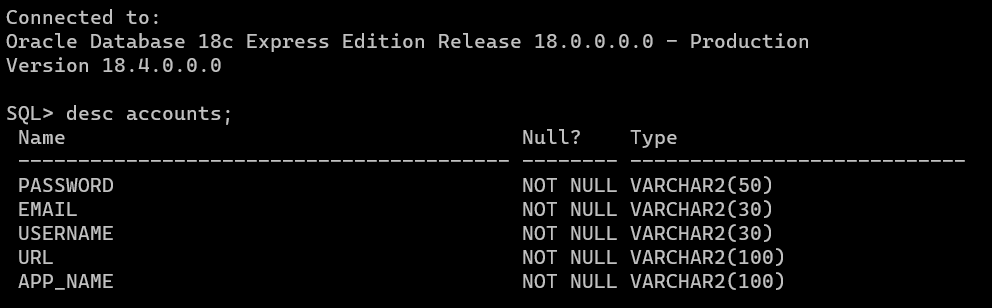

# password-manager
A small password manager using Python and SQL

## Usage
Create a table schema and add the appropriate variables in `database_manager.py`

Run `python3 password-manager.py` to start the password manager

Master password is currently `72984448277`, you can change it in `secret.py`

## DB Schema
